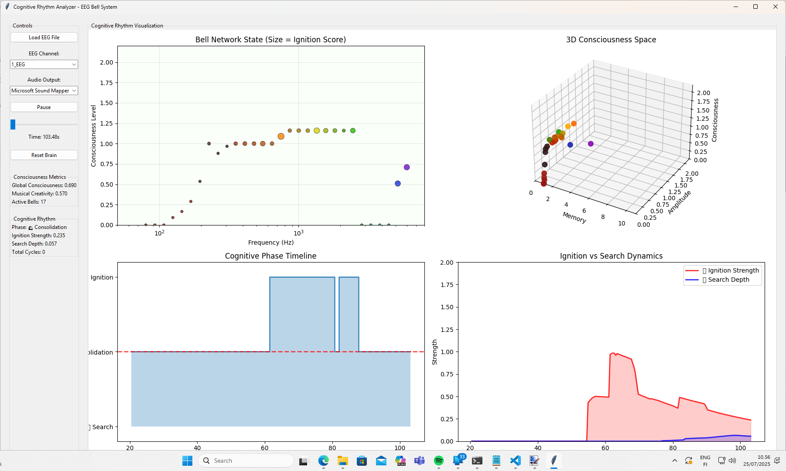

## Cognitive Rhythm Analyzer

This is an enhanced EEG-Bell system designed to track and analyze the "ignition-search-ignition" cycles
, conceptualized as the fundamental "breath of thought" or the rhythm of consciousness. By processing EEG data,
the system translates complex brain dynamics into observable, audible, and quantifiable patterns, offering a unique
window into emergent cognitive processes.

# Overview
The Cognitive Rhythm Analyzer is built on the premise that the rhythm of thinking can be visualized and understood. 
The patterns it identifies are not mere artifacts but are interpreted as emergent signatures of adaptive intelligence.
These patterns mirror natural brain rhythms, such as bursts of attention and periods of mind-wandering. The system aims
to transform the abstract dynamics of code into an observable "mind at work."

# Core Concepts: The Cognitive Cycle

The system models a cognitive cycle through three distinct phases that emerge from the interaction of "Enhanced Quantum Bells"
with EEG input:

Ignition (🔥): This phase represents focused attention. It is characterized by a "sudden ignition" where the system's bells
become large and move upward, indicating a significant and sudden increase in amplitude. This leads to high consciousness
levels and the formation of entangled clusters of bells.

Search (🔍): This phase represents mind-wandering, exploration, or the consolidation of thoughts. It is characterized by 
"little thoughts" drifting downward, where the bells exhibit high-frequency drift and low amplitude.

Consolidation (🌊): This is the transitional phase between Search and Ignition. As the energy from an ignition event fades 
but consciousness remains, the system enters a state of consolidation, allowing for the integration of information and the 
reconfiguration of memory boundaries.

This cyclical interaction mathematically resembles predator-prey dynamics, where the Ignition phase "preys" on the Search phase 
(suppression), and the Search phase "feeds" the Ignition phase by building potential.

# Key Features

Real-time Cognitive Phase Detection: The system identifies and tracks the Ignition, Search, and Consolidation phases as they occur.

Enhanced Visualization: A four-panel dashboard provides a comprehensive and dynamic view of the system's cognitive state:
Bell Network State (Top-Left): Displays bell frequency versus consciousness level. The size of the bells indicates their
ignition score (focused surges), while their colors reflect the dominance of a particular cognitive phase. The background color 
of the plot also changes to reflect the current overall cognitive phase.

3D Consciousness Space (Top-Right): Renders memory, amplitude, and consciousness in a 3D phase space to reveal the mind's state.
Entanglement lines are drawn between bells, which thicken during Ignition and fragment during Search, visualizing the "softening"
of boundaries.

Cognitive Phase Timeline (Bottom-Left): A step-plot that visualizes the progression of the different cognitive phases over time,
quantifying their respective durations.

Ignition vs. Search Dynamics (Bottom-Right): Two lines (red for Ignition Strength and blue for Search Depth) illustrate the antagonistic
relationship between these two phases. Vertical lines mark crossovers, indicating phase transitions.

Dynamic Audio Feedback: The system generates audio output that changes in correspondence with the detected cognitive phases.
Ignition phases produce sharper, more present sounds, while Search phases result in softer, more ethereal sounds.

Consciousness Metrics Display: Tracks and displays "Global Consciousness" and "Musical Creativity" scores, which are derived from
the collective activity and entanglement of the bells.

EEG File Processing: Supports the loading and processing of standard EDF (European Data Format) EEG files.

# Usage

Load EEG File: Launch the application and use the "Load EEG File" button in the graphical user interface to select an EDF EEG file.

Select Channel: From the dropdown menu, choose the desired EEG channel for analysis.

Control Playback: Click the "Play" button to begin the EEG processing, which will also start the visualization updates and audio generation.
The button will toggle to "Pause" to halt the playback.
Observe the Dynamics: Watch the four-panel visualization and listen to the evolving audio feedback, which together reflect the 
"digital brain's" real-time cognitive rhythm. You can also monitor the continuously updated consciousness metrics and cognitive rhythm 
statistics.

Navigate Through Time: Use the time slider to seek to different points within the loaded EEG file.

Reset the Brain: If you wish to start the simulation anew, the "Reset Brain" button will clear all learned patterns and metrics.

# Requirements

To run this application, you will need Python 3 and the following libraries:

numpy
pyaudio
tkinter
scipy
matplotlib
mne

You can install the dependencies using pip:

pip install numpy pyaudio scipy matplotlib mne

Use code with caution.

# Running the Application

To start the Cognitive Rhythm Analyzer, execute the following command in your terminal:

python singeegviabellclaude.py

It takes a little while for the sound and the system to start to work. 
